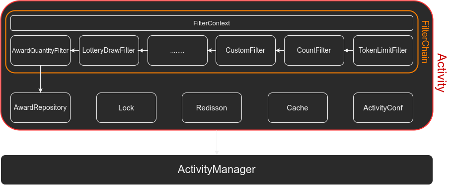

# 分布式秒杀、抽奖、抢红包

```
--学习、开发中
```

## 简介

一个通用的、支持分布式的秒杀、抽奖、抢红包模块。

## 模块

seckill-core：核心功能实现，在项目中必须引入。

seckill-app：示例微服务，可部署集群。

## 使用

### 核心功能的使用

```java
// 活动管理器
ActivityManager activityManager = ActivityManager.instan();
// 活动奖品
List<Award> awards = Arrays.asList(
                new Award("1", 1),
                new Award("2", 2),
                new Award("3", 3),
                new Award("4", 4),
                new Award("5", 5),
                new Award("6", 6)
        );
// 活动配置
ActivityConf conf = ActivityConf.awardSeckill("SeckillTest", 60 * 60 * 1000, System.currentTimeMillis(), awards);
// 奖品库存管理
 LocalAwardRepository localAwardRepository = AwardRepository.local(conf);
// 构造规则过滤器
// token过滤器
LocalTokenLimitFilter localTokenLimitFilter = TokenLimitFilter.localTokenLimit(Filter.FIRST_FILTER_ORDER, 10, 10, NoAcquireParticipantCache.localCache(), conf);
// 参与活动的所有人数过滤器
AllParticipantsCountFilter allParticipantsCountFilter = AllParticipantsCountFilter.localCount(1, 10_000);
// 每秒允许参加活动的人数过滤器
AllParticipantsCountPerFilter allParticipantsCountPerFilter = AllParticipantsCountPerFilter.localCount(2, 1000);
// 整个抽奖活动每个参与者参加次数的过滤器
EntireParticipationCountFilter entireParticipationCountFilter = EntireParticipationCountFilter.localCount(3, 10);
// 每个参与者每秒参加次数过滤器
EveryParticipantCountPerFilter everyParticipantCountFilter = EveryParticipantCountPerFilter.localCount(4, 10);
// 是否中奖过滤器
LotteryDrawFilter lotteryDrawFilter = LotteryDrawFilter.aliasLottery(conf);
// 奖品库存过滤器
AwardQuantityFilter awardQuantityFilter = AwardQuantityFilter.newInstance(localAwardRepository, AwardLock.local());
// 你的自定义过滤器
CustomFilter customFilter = new CustomFilter(5);
// 构造抽奖活动
List<Filter> filters = new ArrayList<>();
filters.add(localTokenLimitFilter);
filters.add(allParticipantsCountFilter);
filters.add(allParticipantsCountPerFilter);
filters.add(entireParticipationCountFilter);
filters.add(everyParticipantCountFilter);
filters.add(lotteryDrawFilter);
filters.add(awardQuantityFilter);
filters.add(customFilter);
// 秒杀奖品活动
CompleteAwardActivity completeAwardActivity = Activity.awardWithLocal(filters, conf);
// 添加到活动管理器
activityManager.addActivity(completeAwardActivity);
// 自动清理过期活动
activityManager.autoClear(60 * 60 * 1000);
// 获取抽奖结果
Award award = activityManager.compete("SeckillTest", new Participant("1234567", "张三"), "6", Award.class);
System.out.println(award);
// 输出线程上下文
System.out.println(activityManager.getFilterContext("SeckillTest"));
```

运行结果

```
Award(id=6, remainCount=5, totalCount=0, probability=0.0)
-----------FilterContext-----------
ThreadId: 1
ThreadName: main
FilterNotPassed: null
FiltersPassed:
cn.mdmbct.seckill.core.filter.token.LocalTokenLimitFilter
cn.mdmbct.seckill.core.filter.count.AllParticipantsCountFilter
cn.mdmbct.seckill.core.filter.count.window.AllParticipantsCountPerFilter
cn.mdmbct.seckill.core.filter.count.EntireParticipationCountFilter
cn.mdmbct.seckill.core.filter.count.window.EveryParticipantCountPerFilter
cn.mdmbct.seckill.core.filter.lottery.LotteryDrawFilter
cn.mdmbct.seckill.core.filter.AwardQuantityFilter

awardId: 6
CompeteRes: Award(id=6, remainCount=5, totalCount=0, probability=0.0)
Participant: Participant(id=1234567, name=张三)
NotPassMsg: null
--------------------------------
```

## 结构

### 大致结构

 

### 组件介绍

#### ActivityConf

一场秒杀、抽奖、请红包活动的配置

#### Cache

奖品、活动、人数、锁等的缓存，可自动清理

#### Redisson

多节点环境下，奖品、人数等的缓存以及 Redis 分布式锁的依赖

#### Lock

JDK 的 `ReentrantLock`、使用 Redis、ZooKeeper 的分布式锁，用于保证多线程下奖品数量的准确

#### AwardRepository

存储奖品及奖品的数量更新

#### Filter

用于筛选满足条件的请求线程，如拿到令牌的线程、满足请求次数要求的线程、拿到奖品锁的线程 、中奖的线程等。可以继承 `Filter` 类实现自定义过滤器。

已经实现的过滤器：


其中的计数过滤器有如下：


#### FilterChain

`FilterChain` 实现了 `Filter` 的链式调用，使用 `Filter` 的 `order` 属性对 `Filter` 进行排序来确定调用顺序，并将线程的数据保存到 `FilterContex` 中。

#### Activity

表示一场活动，每个活动都包含以上所有组件。

#### ActivityManager

将 `Activity` 加入到 `ActivityManager` 以实现自动管理 `Activity`，主要是自动清理过期的活动，并将其用到的缓存包括 Redis 中的缓存都清理掉。

## 说明

1、为什么文档和注释用蹩脚的英文

就是想提高英文水平

2、以`Local` 开头的类适用于单节点运行环境，以`Redis`开头的类适应于多节点分布式运行环境。
